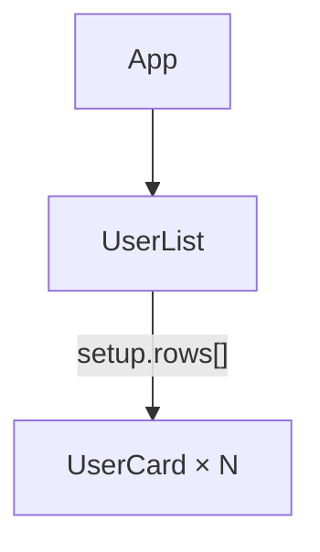
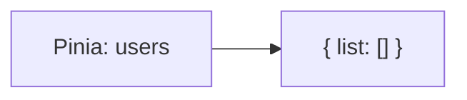

# vite-plugin-vue-probe

[English](./README.md) · [Русский](./README_ru.md)

Dev-only Vite plugin that exposes a read-only `window.VUE_PROBE` for precise Vue 3 runtime inspection — useful for AI agents, Playwright/Cypress scripts, custom tooling, and local debugging.

Built on Vue DevTools v8 (`@vue/devtools-kit`). Provides the component tree, component state, Pinia stores, lazy path-based reads, and component → DOM locators.

> **Status:** proof of concept. The API never ships in production builds, never mutates state, and never invokes actions.

The current public contract is **API 0.2.0**.

---

## Features

| Capability      | Description                                                               |
| --------------- | ------------------------------------------------------------------------- |
| Component tree  | Nested or flat tree with depth limits and name filters                    |
| Component state | Props, setup, data, computed, attrs, provide/inject, refs                 |
| Pinia           | Store list and budgeted store state when the inspector is registered      |
| Lazy paths      | Page large values via `getDetailedState` without dumping the whole object |
| DOM locators    | JSON selectors / rects for a component’s root elements                    |
| Safe envelope   | Every call returns `ProbeResult<T>` — success or structured error         |

---

## Install

Not published to npm yet. Install from GitHub (builds via `prepare`):

```bash
npm install -D github:mewforest/vite-plugin-vue-probe
```

Or from a local clone of this repo:

```bash
npm install -D /absolute/path/to/vite-plugin-vue-probe
```

```ts
// vite.config.ts
import { defineConfig } from "vite";
import vue from "@vitejs/plugin-vue";
import vueProbe from "vite-plugin-vue-probe";

export default defineConfig({
  plugins: [vueProbe(), vue()],
});
```

The plugin uses `apply: 'serve'`, so `window.VUE_PROBE` exists only during `vite serve`.

Temporarily disable without removing the plugin:

```ts
vueProbe({ enabled: false });
```

---

## DevTools console

With `vite serve` running and the plugin enabled, open the page → DevTools → **Console**. On load you should see something like:

```text
🔍 vite-plugin-vue-probe: window.VUE_PROBE ready (API 0.2.0)
```

Each snippet below is **self-contained** — paste any one alone. Names come from a tiny toy app (swap in yours).

<details>
<summary>Toy app shape</summary>





`UserList` holds a large `rows` array; each item renders a `UserCard`.

</details>

Pasteable `.then()` chains below are still single expressions. Variants with explicit `ok` checks are under spoilers.

### 1. Check that the API is available

```js
// Confirm probe is injected
window.VUE_PROBE?.version; // "0.2.0"
```

<details>
<summary>Explained example</summary>

Verbose version with explicit `ok` checks.

```js
const $probe = window.VUE_PROBE;
if (!$probe) throw new Error("VUE_PROBE is not installed");
$probe.version; // "0.2.0"
```

```js
// → "0.2.0"
```

</details>

### 2. List active applications

```js
// Table of Vue apps on the page
await window.VUE_PROBE
  .listApps()
  .then((r) => console.table(r.data));
```

<details>
<summary>Explained example (capabilities + apps)</summary>

Verbose version with explicit `ok` checks.

```js
const $probe = window.VUE_PROBE;
if (!$probe) throw new Error("VUE_PROBE is not installed");

// What the runtime can inspect
const capabilities = await $probe.getCapabilities();
if (!capabilities.ok) throw new Error(capabilities.error.message);

const apps = await $probe.listApps();
if (!apps.ok) throw new Error(apps.error.message);
console.table(apps.data);
```

```js
// → capabilities (abbrev.)
{
  ok: true,
  data: {
    apiVersion: "0.2.0",
    vueDetected: true,
    piniaDetected: true,
    componentTree: true,
    /* … */
  },
  meta: { revision: 1, /* … */ },
}

// → apps.data (abbrev.)
[{ id: "app", name: "App", vueVersion: "3.5.x", active: true }]
```

</details>

### 3. Component tree (flat, up to depth 5)

```js
// Flat tree: id / name / depth
await window.VUE_PROBE
  .getComponentTree({ format: "flat", maxDepth: 5 })
  .then((r) =>
    console.table(
      r.data?.nodes.map((n) => ({
        id: n.id,
        name: n.name,
        depth: n.depth,
      })),
    ),
  );
```

<details>
<summary>Explained example</summary>

Verbose version with explicit `ok` checks.

```js
const $probe = window.VUE_PROBE;
if (!$probe) throw new Error("VUE_PROBE is not installed");

// Prefer flat + maxDepth over dumping a nested tree
const tree = await $probe.getComponentTree({
  format: "flat",
  maxDepth: 3,
});
if (!tree.ok) throw new Error(tree.error.message);
console.table(
  tree.data.nodes.map((n) => ({ id: n.id, name: n.name, depth: n.depth })),
);
```

```js
// → tree.data.nodes (abbrev.)
[
  { id: "app:1", name: "App",      depth: 0 },
  { id: "app:2", name: "UserList", depth: 1 },
  { id: "app:3", name: "UserCard", depth: 2 },
  /* … */
]
```

</details>

### 4. Component state by name (e.g. `UserList`)

```js
// Resolve UserList by name, then read its state
await window.VUE_PROBE
  .getComponentTree({ format: "flat" })
  .then((t) =>
    window.VUE_PROBE.getComponentState(
      t.data?.nodes.find((n) => n.name === "UserList")?.id,
      { appId: t.data?.appId },
    ),
  )
  .then((s) => console.dir(s.data?.state));
```

<details>
<summary>Explained example</summary>

Verbose version with explicit `ok` checks.

```js
const $probe = window.VUE_PROBE;
if (!$probe) throw new Error("VUE_PROBE is not installed");

const tree = await $probe.getComponentTree({ format: "flat", maxDepth: 3 });
if (!tree.ok) throw new Error(tree.error.message);

// Find by display name, then pass appId for multi-app pages
const id = tree.data.nodes.find((n) => n.name === "UserList")?.id;
if (!id) throw new Error("UserList not in tree");

const state = await $probe.getComponentState(id, { appId: tree.data.appId });
if (!state.ok) throw new Error(state.error.message);
console.log(state.data);
```

```js
// → state.data (abbrev.)
{
  name: "UserList",
  state: {
    setup: {
      rows: {
        $type: "truncated",
        kind: "array",
        total: 240,
        returned: 25,
        nextOffset: 25,
        /* … */
      },
    },
  },
}
```

</details>

### 5. DOM locators for a component by name (e.g. `UserCard`)

```js
// Resolve UserCard by name, then table its DOM roots
await window.VUE_PROBE
  .getComponentTree({ format: "flat" })
  .then((t) =>
    window.VUE_PROBE.getComponentDOM(
      t.data?.nodes.find((n) => n.name === "UserCard")?.id,
      { appId: t.data?.appId },
    ),
  )
  .then((d) => console.table(d.data?.roots));
```

<details>
<summary>Explained example</summary>

Verbose version with explicit `ok` checks.

```js
const $probe = window.VUE_PROBE;
if (!$probe) throw new Error("VUE_PROBE is not installed");

const tree = await $probe.getComponentTree({ format: "flat", maxDepth: 3 });
if (!tree.ok) throw new Error(tree.error.message);

// One UserCard — not App (too broad for DOM locators)
const card = tree.data.nodes.find((n) => n.name === "UserCard");
if (!card) throw new Error("UserCard not in tree");

const dom = await $probe.getComponentDOM(card.id, {
  appId: tree.data.appId,
  expectedRevision: tree.meta.revision, // fail fast if tree went stale
});
if (!dom.ok) throw new Error(dom.error.message);
console.log(dom.data.roots);
```

```js
// → dom.data.roots (abbrev.)
[
  {
    index: 0,
    tag: "article",
    selector: "article.user-card",
    rect: { x: 16, y: 120, width: 320, height: 72, /* … */ },
    connected: true,
  },
]
```

</details>

### 6. Read the next page of a large state value

<details>
<summary>Explained example</summary>

Verbose version with explicit `ok` checks.

```js
const $probe = window.VUE_PROBE;
if (!$probe) throw new Error("VUE_PROBE is not installed");

const tree = await $probe.getComponentTree({ format: "flat", maxDepth: 3 });
if (!tree.ok) throw new Error(tree.error.message);

const id = tree.data.nodes.find((n) => n.name === "UserList")?.id;
if (!id) throw new Error("UserList not in tree");

// Page UserList.setup.rows when the first read truncated it
const page = await $probe.getDetailedState(
  { kind: "component", componentId: id, appId: tree.data.appId },
  ["setup", "rows"],
  { offset: 0, limit: 50, expectedRevision: tree.meta.revision },
);
if (!page.ok) throw new Error(page.error.message);

// Continue while nextOffset is present
if (page.data.page?.nextOffset != null) {
  const next = await $probe.getDetailedState(page.data.target, page.data.path, {
    offset: page.data.page.nextOffset,
    limit: page.data.page.limit,
    expectedRevision: page.meta.revision,
  });
  if (!next.ok) throw new Error(next.error.message);
}
```

```js
// → page.data (abbrev.)
{
  path: ["setup", "rows"],
  value: [/* 50 row objects */],
  page: { offset: 0, limit: 50, returned: 50, total: 240, nextOffset: 50 },
}
```

</details>

### 7. Pinia store state by id (e.g. `users`)

```js
// Active app → Pinia store "users" state
await window.VUE_PROBE
  .listApps()
  .then((a) =>
    window.VUE_PROBE.getPiniaState("users", {
      appId: a.data.find((x) => x.active)?.id ?? a.data[0]?.id,
    }),
  )
  .then((p) => console.dir(p.data?.state));
```

<details>
<summary>Explained example (stores + state)</summary>

Verbose version with explicit `ok` checks.

```js
const $probe = window.VUE_PROBE;
if (!$probe) throw new Error("VUE_PROBE is not installed");

const apps = await $probe.listApps();
if (!apps.ok) throw new Error(apps.error.message);
const appId = apps.data.find((a) => a.active)?.id ?? apps.data[0]?.id;

// IDs only by default
const stores = await $probe.getPiniaStores({ appId });
if (!stores.ok) throw new Error(stores.error.message);

// Opt-in: also list keys inside each store
const storesWithKeys = await $probe.getPiniaStores({
  appId,
  includeKeys: true,
});
if (!storesWithKeys.ok) throw new Error(storesWithKeys.error.message);

const pinia = await $probe.getPiniaState("users", { appId });
if (!pinia.ok) throw new Error(pinia.error.message);
console.log(pinia.data);
```

```js
// → stores.data / pinia.data (abbrev.)
[{ appId: "app", id: "users" }]
[{ appId: "app", id: "users", stateKeys: ["list"], getterKeys: [] }]
{ storeId: "users", state: { list: [/* … */] } }
```

</details>

`getComponentDOM()` returns a selector relative to the node's root. For an
open Shadow DOM it also returns `shadowHostSelectors` in outer-to-inner order:
resolve each host, enter its `shadowRoot`, then resolve `selector`. Closed
shadow roots intentionally return `selector: null`.

> `getComponentDOM()` is bounded to 200 DOM roots. Do not use the root `App` as
> a whole-page DOM query: choose the specific rendered component you need. If a
> component exposes a large Fragment or `v-for` root, the call returns
> `INTERNAL_ERROR` with the 200-root limit; select a more specific child instead.

Every call returns a JSON-safe envelope:

```ts
type ProbeResult<T> =
  | {
      ok: true;
      data: T;
      meta: { requestId: string; revision: number; observedAt: string };
    }
  | {
      ok: false;
      error: { code: string; message: string };
      meta: { requestId: string; revision: number; observedAt: string };
    };
```

If `window.VUE_PROBE` is `undefined`, the plugin is not injected (production build, `enabled: false`, or not in `vite.config`).

### Budgets and revisions

- Initial reads default to depth `2`, `25` entries, and `500` string characters; detailed reads default to depth `3` and page size `50`.
- For serialized component/Pinia/detail state data, hard limits are depth `20`, `200` entries per container/page, `100,000` characters per string, `1,000,000` aggregate emitted string characters, and `5,000` serialized nodes. This aggregate limit does not describe envelopes, app lists, or component trees. Identifier/path length and offset limits are reported by `getCapabilities()`.
- `revision` is an inspector-invalidation token, not a mutation counter. Component lifecycle/update events and Pinia inspector-state invalidation advance it; an unattributed invalidation conservatively advances every live app.
- Snapshot reads check revision before and after the read. A mismatched `expectedRevision`, or an update during the read, returns `STALE_REVISION`; retry from a fresh response revision.

---

## AI agent skill

This repo ships an Agent Skill that teaches compatible coding agents to call
`window.VUE_PROBE` safely (budgets, truncation, error envelopes). It follows the
portable `SKILL.md` format.

### Recommended: one shared project skill

For a team repository that uses more than one agent, install the skill once in
the neutral `.agents/skills` location. GitHub Copilot officially supports this
location alongside its native one, and Codex can use the same project skill.

```bash
# From this repo / package root, run in the consumer project
mkdir -p .agents/skills
cp -R skills/vue-probe .agents/skills/vue-probe
```

### Platform-specific locations

| Agent | Project skill (commit to Git) | Personal skill (all local projects) |
| --- | --- | --- |
| Cursor | `.cursor/skills/vue-probe` | `~/.cursor/skills/vue-probe` |
| [Claude Code](https://code.claude.com/docs/en/slash-commands) | `.claude/skills/vue-probe` | `~/.claude/skills/vue-probe` |
| Codex | `.agents/skills/vue-probe` | `~/.codex/skills/vue-probe` |
| [GitHub Copilot](https://docs.github.com/en/copilot/how-tos/copilot-on-github/customize-copilot/customize-cloud-agent/add-skills) | `.github/skills/vue-probe` (also `.agents/skills` or `.claude/skills`) | `~/.copilot/skills/vue-probe` (also `~/.agents/skills`) |

For example, to install it only for Claude Code in the current project:

```bash
mkdir -p .claude/skills
cp -R skills/vue-probe .claude/skills/vue-probe
```

For a personal Codex installation:

```bash
mkdir -p ~/.codex/skills
cp -R skills/vue-probe ~/.codex/skills/vue-probe
```

GitHub Copilot CLI can reload a newly copied skill with `/skills reload`; other
clients may require starting a new session. Keep the directory intact: the
entrypoint must remain `SKILL.md`.

Skill source: [`skills/vue-probe/SKILL.md`](./skills/vue-probe/SKILL.md).

After installation, agents can use it when debugging Vue runtime state, writing
Playwright probes, or when you mention `VUE_PROBE` / `vite-plugin-vue-probe`.

---

## PoC limitations

- Vue 3 + Vite dev server only — no production API surface
- Pinia works when the app registers its custom inspector
- Fragment/Suspense/Teleport/KeepAlive root extraction is structural and bounded; it depends on the Vue DevTools VNode shapes available at runtime
- Runtime tests pin `vue@3.5.22`, `pinia@3.0.3` and `vite@^8.0.0`: they mount Fragment, Suspense, Teleport, KeepAlive, two apps, and option/setup stores. The real DevTools browser hook remains the consumer-application integration boundary
- Event timeline, subscriptions, state mutation, and action calls are out of scope for v1
- Intended for trusted local development — runtime state may contain secrets

The dev client owns its DevTools subscriptions and releases them on HMR dispose/uninstall. Package entrypoints are emitted as Node-compatible ESM and covered by a dist import smoke test.

---

## Architecture

```text
DevtoolsDataSource → normalizer → budgeted serializer → Probe API facade
```

Vue DevTools types never leak into the public contract. If this lands in `vuejs/devtools` later, only the data source / registration layer needs to change; the serializer and consumer-friendly API stay the same.

---

## Scripts

```bash
npm test
npm run typecheck
npm run build
npm run test:dist
npm run test:types-dist
```

---

## License

MIT
