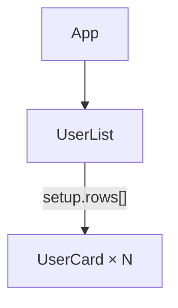
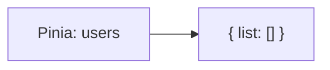

# vite-plugin-vue-probe

[English](./README.md) · [Русский](./README_ru.md)

Dev-only Vite-плагин, который публикует read-only `window.VUE_PROBE` для точной инспекции Vue 3 в runtime — для ИИ-агентов, Playwright/Cypress, кастомного tooling и локальной отладки.

PoC опирается на Vue DevTools v8 (`@vue/devtools-kit`) и даёт дерево компонентов, component state, Pinia, ленивое path-based чтение и component → DOM locators.

> **Статус:** proof of concept. API намеренно не попадает в production build, не изменяет state и не вызывает actions.

Текущая версия публичного контракта — **API 0.2.0**.

---

## Возможности

| Возможность          | Описание                                                               |
| -------------------- | ---------------------------------------------------------------------- |
| Дерево компонентов   | Nested или flat, с лимитом глубины и фильтром по имени                 |
| Состояние компонента | Props, setup, data, computed, attrs, provide/inject, refs              |
| Pinia                | Список store и budgeted state, если inspector зарегистрирован          |
| Ленивые paths        | Дочитывание больших значений через `getDetailedState` без полного dump |
| DOM-локаторы         | JSON selectors / rects для корневых элементов компонента               |
| Безопасный ответ     | Каждый вызов — `ProbeResult<T>`: успех или структурированная ошибка    |

---

## Установка и подключение

Пока пакет не опубликован в npm. Установка с GitHub (сборка через `prepare`):

```bash
npm install -D github:mewforest/vite-plugin-vue-probe
```

Или из локального клона этого репозитория:

```bash
npm install -D /absolute/path/to/vite-plugin-vue-probe
```

```ts
// vite.config.ts
import { defineConfig } from "vite";
import vue from "@vitejs/plugin-vue";
import vueProbe from "vite-plugin-vue-probe";

export default defineConfig({
  plugins: [vueProbe(), vue()],
});
```

Плагин использует `apply: 'serve'`: `window.VUE_PROBE` создаётся только при `vite serve`.

Временно отключить без удаления из конфига:

```ts
vueProbe({ enabled: false });
```

---

## Консоль DevTools

При запущенном `vite serve` и включённом плагине откройте страницу → DevTools → **Console**. При инициализации в консоли появится что-то вроде:

```text
🔍 vite-plugin-vue-probe: window.VUE_PROBE ready (API 0.2.0)
```

Каждый сниппет ниже **самодостаточен** — можно вставить любой отдельно. Имена в примерах — из toy-приложения (подставьте свои).

<details>
<summary>Схема toy-приложения</summary>





`UserList` держит большой `rows`; каждый элемент рендерит `UserCard`.

</details>

Цепочки `.then()` ниже — единые выражения: копируйте целиком в консоль. Варианты с явными проверками `ok` — под спойлером.

### 1. Проверить, что API доступен

```js
// Проверить, что probe инжектирован
window.VUE_PROBE?.version; // "0.2.0"
```

<details>
<summary>Explained example</summary>

Verbose-версия с явными проверками `ok`.

```js
const $probe = window.VUE_PROBE;
if (!$probe) throw new Error("VUE_PROBE не установлен");
$probe.version; // "0.2.0"
```

```js
// → "0.2.0"
```

</details>

### 2. Список активных приложений

```js
// Таблица Vue-приложений на странице
await window.VUE_PROBE
  .listApps()
  .then((r) => console.table(r.data));
```

<details>
<summary>Explained example (capabilities + apps)</summary>

Verbose-версия с явными проверками `ok`.

```js
const $probe = window.VUE_PROBE;
if (!$probe) throw new Error("VUE_PROBE не установлен");

// Что runtime умеет инспектировать
const capabilities = await $probe.getCapabilities();
if (!capabilities.ok) throw new Error(capabilities.error.message);

const apps = await $probe.listApps();
if (!apps.ok) throw new Error(apps.error.message);
console.table(apps.data);
```

```js
// → capabilities (сокр.)
{
  ok: true,
  data: {
    apiVersion: "0.2.0",
    vueDetected: true,
    piniaDetected: true,
    componentTree: true,
    /* … */
  },
  meta: { revision: 1, /* … */ },
}

// → apps.data (сокр.)
[{ id: "app", name: "App", vueVersion: "3.5.x", active: true }]
```

</details>

### 3. Дерево компонентов (плоское, до 5 уровня)

```js
// Плоское дерево: id / name / depth
await window.VUE_PROBE
  .getComponentTree({ format: "flat", maxDepth: 5 })
  .then((r) =>
    console.table(
      r.data?.nodes.map((n) => ({
        id: n.id,
        name: n.name,
        depth: n.depth,
      })),
    ),
  );
```

<details>
<summary>Explained example</summary>

Verbose-версия с явными проверками `ok`.

```js
const $probe = window.VUE_PROBE;
if (!$probe) throw new Error("VUE_PROBE не установлен");

// Предпочитайте flat + maxDepth вместо полного nested dump
const tree = await $probe.getComponentTree({
  format: "flat",
  maxDepth: 3,
});
if (!tree.ok) throw new Error(tree.error.message);
console.table(
  tree.data.nodes.map((n) => ({ id: n.id, name: n.name, depth: n.depth })),
);
```

```js
// → tree.data.nodes (сокр.)
[
  { id: "app:1", name: "App",      depth: 0 },
  { id: "app:2", name: "UserList", depth: 1 },
  { id: "app:3", name: "UserCard", depth: 2 },
  /* … */
]
```

</details>

### 4. Стейт конкретного компонента по имени (например, `UserList`)

```js
// Найти UserList по имени и прочитать state
await window.VUE_PROBE
  .getComponentTree({ format: "flat" })
  .then((t) =>
    window.VUE_PROBE.getComponentState(
      t.data?.nodes.find((n) => n.name === "UserList")?.id,
      { appId: t.data?.appId },
    ),
  )
  .then((s) => console.dir(s.data?.state));
```

<details>
<summary>Explained example</summary>

Verbose-версия с явными проверками `ok`.

```js
const $probe = window.VUE_PROBE;
if (!$probe) throw new Error("VUE_PROBE не установлен");

const tree = await $probe.getComponentTree({ format: "flat", maxDepth: 3 });
if (!tree.ok) throw new Error(tree.error.message);

// Ищем по display name; appId нужен на multi-app страницах
const id = tree.data.nodes.find((n) => n.name === "UserList")?.id;
if (!id) throw new Error("UserList нет в дереве");

const state = await $probe.getComponentState(id, { appId: tree.data.appId });
if (!state.ok) throw new Error(state.error.message);
console.log(state.data);
```

```js
// → state.data (сокр.)
{
  name: "UserList",
  state: {
    setup: {
      rows: {
        $type: "truncated",
        kind: "array",
        total: 240,
        returned: 25,
        nextOffset: 25,
        /* … */
      },
    },
  },
}
```

</details>

### 5. DOM-локаторы компонента по имени (например, `UserCard`)

```js
// Найти UserCard по имени и вывести DOM roots
await window.VUE_PROBE
  .getComponentTree({ format: "flat" })
  .then((t) =>
    window.VUE_PROBE.getComponentDOM(
      t.data?.nodes.find((n) => n.name === "UserCard")?.id,
      { appId: t.data?.appId },
    ),
  )
  .then((d) => console.table(d.data?.roots));
```

<details>
<summary>Explained example</summary>

Verbose-версия с явными проверками `ok`.

```js
const $probe = window.VUE_PROBE;
if (!$probe) throw new Error("VUE_PROBE не установлен");

const tree = await $probe.getComponentTree({ format: "flat", maxDepth: 3 });
if (!tree.ok) throw new Error(tree.error.message);

// Один UserCard — не App (слишком широко для DOM-локаторов)
const card = tree.data.nodes.find((n) => n.name === "UserCard");
if (!card) throw new Error("UserCard нет в дереве");

const dom = await $probe.getComponentDOM(card.id, {
  appId: tree.data.appId,
  expectedRevision: tree.meta.revision, // быстро упасть, если дерево устарело
});
if (!dom.ok) throw new Error(dom.error.message);
console.log(dom.data.roots);
```

```js
// → dom.data.roots (сокр.)
[
  {
    index: 0,
    tag: "article",
    selector: "article.user-card",
    rect: { x: 16, y: 120, width: 320, height: 72, /* … */ },
    connected: true,
  },
]
```

</details>

### 6. Прочитать следующую страницу большого state-значения

<details>
<summary>Explained example</summary>

Verbose-версия с явными проверками `ok`.

```js
const $probe = window.VUE_PROBE;
if (!$probe) throw new Error("VUE_PROBE не установлен");

const tree = await $probe.getComponentTree({ format: "flat", maxDepth: 3 });
if (!tree.ok) throw new Error(tree.error.message);

const id = tree.data.nodes.find((n) => n.name === "UserList")?.id;
if (!id) throw new Error("UserList нет в дереве");

// Дочитываем UserList.setup.rows, если первый read обрезал значение
const page = await $probe.getDetailedState(
  { kind: "component", componentId: id, appId: tree.data.appId },
  ["setup", "rows"],
  { offset: 0, limit: 50, expectedRevision: tree.meta.revision },
);
if (!page.ok) throw new Error(page.error.message);

// Пока есть nextOffset — читаем следующую страницу
if (page.data.page?.nextOffset != null) {
  const next = await $probe.getDetailedState(page.data.target, page.data.path, {
    offset: page.data.page.nextOffset,
    limit: page.data.page.limit,
    expectedRevision: page.meta.revision,
  });
  if (!next.ok) throw new Error(next.error.message);
}
```

```js
// → page.data (сокр.)
{
  path: ["setup", "rows"],
  value: [/* 50 объектов строк */],
  page: { offset: 0, limit: 50, returned: 50, total: 240, nextOffset: 50 },
}
```

</details>

### 7. Стейт конкретного Pinia-стора (например, `users`)

```js
// Активное app → state Pinia-стора "users"
await window.VUE_PROBE
  .listApps()
  .then((a) =>
    window.VUE_PROBE.getPiniaState("users", {
      appId: a.data.find((x) => x.active)?.id ?? a.data[0]?.id,
    }),
  )
  .then((p) => console.dir(p.data?.state));
```

<details>
<summary>Explained example (stores + state)</summary>

Verbose-версия с явными проверками `ok`.

```js
const $probe = window.VUE_PROBE;
if (!$probe) throw new Error("VUE_PROBE не установлен");

const apps = await $probe.listApps();
if (!apps.ok) throw new Error(apps.error.message);
const appId = apps.data.find((a) => a.active)?.id ?? apps.data[0]?.id;

// По умолчанию только id сторов
const stores = await $probe.getPiniaStores({ appId });
if (!stores.ok) throw new Error(stores.error.message);

// Опционально: ещё и ключи внутри каждого store
const storesWithKeys = await $probe.getPiniaStores({
  appId,
  includeKeys: true,
});
if (!storesWithKeys.ok) throw new Error(storesWithKeys.error.message);

const pinia = await $probe.getPiniaState("users", { appId });
if (!pinia.ok) throw new Error(pinia.error.message);
console.log(pinia.data);
```

```js
// → stores.data / pinia.data (сокр.)
[{ appId: "app", id: "users" }]
[{ appId: "app", id: "users", stateKeys: ["list"], getterKeys: [] }]
{ storeId: "users", state: { list: [/* … */] } }
```

</details>

`getComponentDOM()` возвращает selector относительно root узла. Для открытого
Shadow DOM поле `shadowHostSelectors` задаёт цепочку снаружи внутрь: найти host,
перейти в его `shadowRoot`, затем применить итоговый `selector`. Для закрытого
shadow root намеренно возвращается `selector: null`.

> `getComponentDOM()` ограничен 200 корневыми DOM-элементами. Не используйте
> корневой `App` как запрос DOM всей страницы: выберите конкретный отрисованный
> компонент. Если компонент публикует большой Fragment или корень с `v-for`, метод
> вернёт `INTERNAL_ERROR` с сообщением о лимите 200; выберите более узкий дочерний
> компонент.

Каждый вызов возвращает JSON-safe envelope:

```ts
type ProbeResult<T> =
  | {
      ok: true;
      data: T;
      meta: { requestId: string; revision: number; observedAt: string };
    }
  | {
      ok: false;
      error: { code: string; message: string };
      meta: { requestId: string; revision: number; observedAt: string };
    };
```

Если `window.VUE_PROBE` — `undefined`, плагин не инжектится (production build, `enabled: false`, или нет в `vite.config`).

### Budgets и revisions

- Initial read: depth `2`, `25` entries и `500` символов строки; detailed read: depth `3`, page size `50`.
- Для serialized component/Pinia/detail state data hard limits равны depth `20`, `200` entries на container/page, `100 000` символов на строку, `1 000 000` символов суммарно и `5 000` узлов. Aggregate limit не относится к envelope, app list и component tree. Ограничения identifier/path/offset публикует `getCapabilities()`.
- `revision` — token инвалидизации inspector, а не счётчик mutations. Его меняют component lifecycle/update events и инвалидизация Pinia inspector state; событие без appId консервативно инвалидирует все live apps.
- Snapshot read проверяет revision до и после чтения. Несовпавший `expectedRevision` или update во время чтения даёт `STALE_REVISION`; повторять нужно с revision свежего ответа.

---

## Skill для ИИ-агентов

В репозитории есть Agent Skill: он учит совместимых coding-агентов безопасно
вызывать `window.VUE_PROBE` (budgets, truncation, error envelopes). Формат
`SKILL.md` переносим между агентами.

### Рекомендуется: один общий skill в проекте

Если в команде используется несколько агентов, установите skill один раз в
нейтральный каталог `.agents/skills`. GitHub Copilot официально поддерживает
этот путь наряду с нативным, а Codex может использовать тот же project skill.

```bash
# Из корня этого репо / пакета; выполнять в проекте-потребителе
mkdir -p .agents/skills
cp -R skills/vue-probe .agents/skills/vue-probe
```

### Пути для отдельных платформ

| Агент | Project skill (добавьте в Git) | Personal skill (для всех локальных проектов) |
| --- | --- | --- |
| Cursor | `.cursor/skills/vue-probe` | `~/.cursor/skills/vue-probe` |
| [Claude Code](https://code.claude.com/docs/en/slash-commands) | `.claude/skills/vue-probe` | `~/.claude/skills/vue-probe` |
| Codex | `.agents/skills/vue-probe` | `~/.codex/skills/vue-probe` |
| [GitHub Copilot](https://docs.github.com/en/copilot/how-tos/copilot-on-github/customize-copilot/customize-cloud-agent/add-skills) | `.github/skills/vue-probe` (также `.agents/skills` или `.claude/skills`) | `~/.copilot/skills/vue-probe` (также `~/.agents/skills`) |

Например, чтобы установить skill только для Claude Code в текущий проект:

```bash
mkdir -p .claude/skills
cp -R skills/vue-probe .claude/skills/vue-probe
```

Для личной установки в Codex:

```bash
mkdir -p ~/.codex/skills
cp -R skills/vue-probe ~/.codex/skills/vue-probe
```

В GitHub Copilot CLI новый skill можно подхватить командой `/skills reload`; в
остальных клиентах может потребоваться новая сессия. Не меняйте структуру
каталога: entrypoint должен оставаться `SKILL.md`.

Исходник: [`skills/vue-probe/SKILL.md`](./skills/vue-probe/SKILL.md).

После установки агенты подхватывают skill при отладке Vue runtime, написании
Playwright-проб или упоминании `VUE_PROBE` / `vite-plugin-vue-probe`.

---

## Ограничения PoC

- Только Vue 3 и Vite dev server — в production API нет
- Pinia доступна, когда её custom inspector зарегистрирован приложением
- Root extraction для Fragment/Suspense/Teleport/KeepAlive структурный и ограниченный; он зависит от доступной runtime-формы Vue DevTools VNode
- Runtime tests фиксируют `vue@3.5.22` и `pinia@3.0.3`: монтируются Fragment, Suspense, Teleport, KeepAlive, два приложения и option/setup stores. Реальный browser DevTools hook остаётся integration boundary consumer-приложения
- Event timeline, subscriptions, mutation state и вызов actions не входят в v1
- API только для доверенной локальной разработки — runtime state может содержать чувствительные данные

Dev client владеет DevTools subscriptions и освобождает их при HMR dispose/uninstall. Package entrypoints собираются как Node-compatible ESM и проверяются dist import smoke test.

---

## Архитектура

```text
DevtoolsDataSource → normalizer → budgeted serializer → Probe API facade
```

Типы Vue DevTools не выходят в публичный контракт. При переносе в `vuejs/devtools` меняются data source / регистрация; serializer и consumer-friendly API сохраняются.

---

## Проверка

```bash
npm test
npm run typecheck
npm run build
npm run test:dist
npm run test:types-dist
```

---

## Лицензия

MIT
