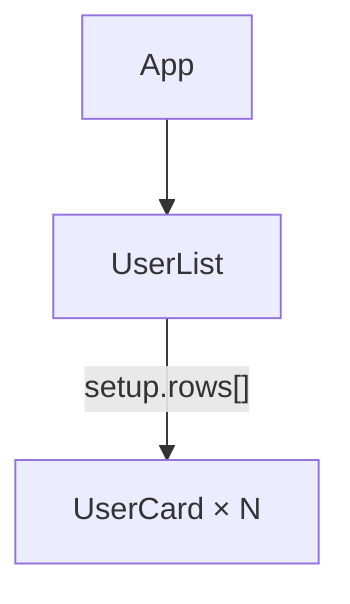

# Vue Probe

Read-only runtime inspection for Vue 3 apps that use `vite-plugin-vue-probe`.
API exists only during `vite serve` as `window.VUE_PROBE`.
This workflow targets API `0.4.0`; verify `window.VUE_PROBE.version` first.

## Preconditions

1. Confirm the app is on a Vite **dev** server (not production).
2. In the page context, check:

```js
typeof window.VUE_PROBE;
```

If `undefined`, the plugin is missing, disabled, or this is a production build. Stop and tell the user.

## Rules

- **Read-only** — never invent mutation helpers; v1 cannot edit state or call actions.
- Core methods return `ProbeResult<T>`: `{ ok: true, data, meta }` or
  `{ ok: false, error, meta }`. Always check `ok` before using their `data`.
- Prefer `VUE_PROBE.query` for routine reads. Fluent `run()` unwraps successful
  `data`; `show()` formats, prints, and returns the printed value. Both throw
  `ProbeQueryError` on failure.
- Use core methods when the workflow needs failure envelopes, raw `meta`, or
  manual `expectedRevision` coordination.
- **Format before context:** after every `getComponentTree`, `getComponentState`,
  `getPiniaState`, or `getComponentDOM` call, you MUST run the successful data
  through `VUE_PROBE.formatters` before adding it to agent context. Use
  `toMarkdown` for trees/state and `domToTable` for DOM roots. Keep the raw
  response inside the page/tool execution only.
- **Discover paths, never guess them:** when state contains a truncated array or
  object and its exact `getDetailedState` path is unclear, first call
  `formatters.stateToPaths(state.data.state)` and use the emitted path.
- **No autonomous bypass:** use `{ bypassBudgets: true }` only when the user
  directly asks for a complete/full state or store read. It spends browser work
  and context aggressively. Otherwise keep soft budgets and paginate.
- Prefer `format: 'flat'` + `maxDepth` for trees; page large values with `getDetailedState`.
- Oversized values arrive as `{ $type: 'truncated', path, total, nextOffset, ... }` — page them, do not dump blindly.
- Keep the selected `appId` on state and DOM reads in multi-app pages.
- Treat `revision` as inspector invalidation. A snapshot can become stale while it is being read.

## Example app shape (abbreviated)

Snippets below assume this toy tree — replace names with the consumer app’s:




## Workflow

```js
const $probe = window.VUE_PROBE;
if (!$probe) throw new Error("VUE_PROBE missing");
const $pq = $probe.query;

const caps = await $probe.getCapabilities();
if (!caps.ok) throw new Error(caps.error.message);
const apps = await $pq.apps().run();

// Query construction is lazy; show() executes and returns this string.
const treeMarkdown = await $pq.app().tree({
  maxDepth: 3,
  filter: "User", // optional: UserList / UserCard
}).show("markdown");

// State of the list (rows may be truncated)
const listQuery = $pq.app().component("UserList");
const stateMarkdown = await listQuery.get().show("markdown");
const statePaths = await listQuery.get().show("paths");

// DOM of one card — not App
const domRows = await $pq
  .app()
  .component("UserCard")
  .dom()
  .show("table");

// Page UserList.setup.rows explicitly; there is no unbounded all() helper.
const page = await listQuery
  .get("setup.rows")
  .page({ offset: 0, limit: 50 })
  .run();
const pageJson =
  page.page?.nextOffset == null
    ? null
    : await listQuery
        .get("setup.rows")
        .page({ offset: page.page.nextOffset, limit: page.page.limit })
        .show("json");

const stores = await $pq.app().pinia().run(); // IDs only
const storesWithKeys = await $pq.app().pinia({
  includeKeys: true,
}).run();
const piniaMarkdown = await $pq
  .app()
  .pinia("users")
  .get()
  .show("markdown");

// Return compact strings/rows to the agent/tool boundary, not raw payloads.
({
  apps,
  treeMarkdown,
  stateMarkdown,
  statePaths,
  domRows,
  pageJson,
  stores,
  storesWithKeys,
  piniaMarkdown,
});
```

Hard limits exposed by capabilities for serialized state data include depth
`20`, entries/page `200`, string length `100000`, aggregate string output
`1000000`, and `5000` serialized nodes. The aggregate does not describe
envelopes, app lists, or trees. Never try to
work around a hard limit by requesting a single oversized payload; page it.

To replay a DOM locator, start at `document`, resolve every
`shadowHostSelectors` entry in order and enter the host's open `shadowRoot`,
then resolve `selector`. `selector: null` means no safe replayable locator is
available (detached node, ambiguous path, or closed shadow root).

`getComponentDOM()` is limited to 200 DOM roots. Use it for a specific rendered
component (e.g. `UserCard`), not root `App`. If it returns `INTERNAL_ERROR`
about that limit, narrow the tree filter or pick a more specific child.

## From Playwright / browser tools

Run the same calls inside the page:

```js
await page.evaluate(async () => {
  const api = window.VUE_PROBE;
  if (!api)
    return {
      ok: false,
      error: { code: "NOT_AVAILABLE", message: "VUE_PROBE missing" },
    };
  const tree = await api.getComponentTree({ format: "flat", maxDepth: 2 });
  if (!tree.ok) return tree;
  return { ok: true, markdown: api.formatters.toMarkdown(tree.data) };
});
```

For an explicit user request such as “read the entire store”, bypass soft
budgets but keep detailed reads paginated:

```js
const state = await $probe.getPiniaState("users", {
  appId: tree.data.appId,
  bypassBudgets: true,
});
if (!state.ok) throw new Error(state.error.message);
$probe.formatters.toMarkdown(state.data.state);
```

## Error codes

`NOT_READY` · `APP_NOT_FOUND` · `COMPONENT_NOT_FOUND` · `STORE_NOT_FOUND` · `PATH_NOT_FOUND` · `INVALID_OPTIONS` · `STALE_REVISION` · `INTERNAL_ERROR`

On `STALE_REVISION`, discard the partial workflow and start from a fresh tree/state response. Use its latest `meta.revision`; omit `expectedRevision` unless coordinating snapshot pages.
